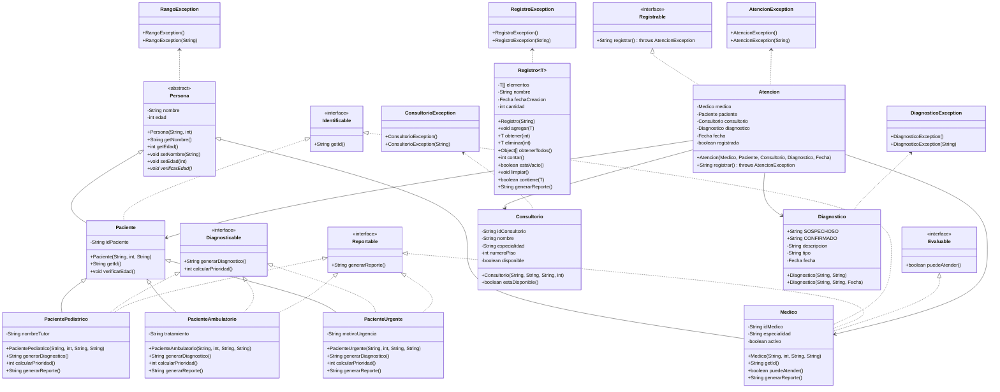

# Proyecto - Gestión de Excepciones y Polimorfismo

## Objetivo del Proyecto
Proyecto orientado a objetos en Java que demuestra el manejo de información de pacientes hospitalarios, el uso de herencia, polimorfismo con interfaces y clases abstractas, genericidad, manejo de excepciones personalizadas y pruebas unitarias.

# Proyecto: gestión de excepciones y polimorfismo

Proyecto de Java orientado a objetos para modelar un consultorio u hospital con pacientes, médicos, consultorios, diagnósticos y atenciones. El código demuestra herencia, interfaces, polimorfismo, clases genéricas y excepciones personalizadas.

## Qué incluye

- Pacientes con distintos perfiles: urgente, ambulatorio y pediátrico.
- Médicos con validación de edad y disponibilidad para atender.
- Consultorios y diagnósticos con validaciones específicas.
- Registro genérico para guardar y reportar entidades tipadas.
- Carga de pacientes desde archivo de texto.
- Pruebas unitarias con JUnit 5.

## Estructura principal

- [miPrincipal/Principal.java](miPrincipal/Principal.java): punto de entrada del programa.
- [miPrincipal/Registro.java](miPrincipal/Registro.java): clase genérica para almacenar elementos.
- [miPrincipal/LeerPacientes.java](miPrincipal/LeerPacientes.java): carga pacientes desde [pacientes.txt](pacientes.txt).
- [miTest/AppTest.java](miTest/AppTest.java): pruebas unitarias del proyecto.
- [logica/Fecha.java](logica/Fecha.java): tipo auxiliar para fechas del dominio.

## Requisitos

- Java instalado con `javac` y `java` disponibles.
- `make` para usar los comandos del proyecto.
- La librería de JUnit ya viene incluida en [lib/](lib/).

## Cómo ejecutar

### Compilar, probar y ejecutar todo

```bash
make
```

### Compilar solamente

```bash
make compile
```

### Ejecutar las pruebas

```bash
make test
```

### Ejecutar el programa principal

```bash
make run
```

### Limpiar archivos compilados

```bash
make clean
```

## Flujo del programa

La clase [miPrincipal/Principal.java](miPrincipal/Principal.java) hace una demostración completa del dominio:

1. Carga pacientes desde [pacientes.txt](pacientes.txt).
2. Crea pacientes polimórficos usando la jerarquía de [Persona](miPrincipal/Persona.java).
3. Instancia médicos, consultorios y diagnósticos.
4. Registra una atención médica.
5. Muestra ejemplos de uso de [Registro<T>](miPrincipal/Registro.java) con pacientes, médicos, consultorios y diagnósticos.
6. Ejecuta escenarios de manejo de excepciones.

## Registro genérico

La clase [Registro<T>](miPrincipal/Registro.java) permite almacenar colecciones tipadas y ofrece estas operaciones:

- `agregar(T elemento)`
- `obtener(int indice)`
- `eliminar(int indice)`
- `Object[] obtenerTodos()`
- `contar()`
- `estaVacio()`
- `limpiar()`
- `contiene(T elemento)`
- `generarReporte()`

## Modelo de dominio

- [Persona](miPrincipal/Persona.java): clase base abstracta con nombre, edad y validación de edad.
- [Paciente](miPrincipal/Paciente.java): base de los tipos de paciente.
- [PacienteUrgente](miPrincipal/PacienteUrgente.java), [PacienteAmbulatorio](miPrincipal/PacienteAmbulatorio.java) y [PacientePediatrico](miPrincipal/PacientePediatrico.java): variantes polimórficas con prioridad, diagnóstico y reporte.

### Clases principales del proceso clínico

- [Medico](miPrincipal/Medico.java): representa al doctor que participa en la atención. Guarda su identificador, especialidad y estado de disponibilidad. Además implementa reporte y verificación de si puede atender.
- [Consultorio](miPrincipal/Consultorio.java): modela el espacio físico donde se realiza la atención. Conserva el id, nombre, especialidad, piso y disponibilidad, y valida que el número de piso no sea negativo.
- [Diagnostico](miPrincipal/Diagnostico.java): encapsula la información médica del caso. Maneja la descripción, el tipo de diagnóstico y la fecha en la que se genera, además de validar los tipos permitidos.
- [Atencion](miPrincipal/Atencion.java): une al médico, paciente, consultorio y diagnóstico en un solo registro clínico. Su método `registrar()` valida que el médico y el consultorio estén disponibles antes de marcar la atención como registrada.
- [Registrable](miPrincipal/Registrable.java): interfaz que define el contrato para cualquier clase que pueda registrarse en el sistema. Obliga a implementar `registrar()`, que debe devolver un mensaje de confirmación y puede lanzar [AtencionException](miPrincipal/AtencionException.java) si no se cumplen las validaciones necesarias.

- Excepciones personalizadas: [RangoException](miPrincipal/RangoException.java), [ConsultorioException](miPrincipal/ConsultorioException.java), [DiagnosticoException](miPrincipal/DiagnosticoException.java), [AtencionException](miPrincipal/AtencionException.java) y [RegistroException](miPrincipal/RegistroException.java).

## Archivos de apoyo

- [compfiles.txt](compfiles.txt): listado temporal de archivos Java generado por el proceso de compilación.
- [pacientes.txt](pacientes.txt): datos de ejemplo para la carga inicial.

## Nota sobre diagramas

El repositorio también puede documentarse con diagramas UML o archivos `.drawio.png` si quieres mantener una vista visual del modelo.

### Diagrama de clases



[Referencia Mermaid](https://mermaid.js.org/syntax/classDiagram.html)
